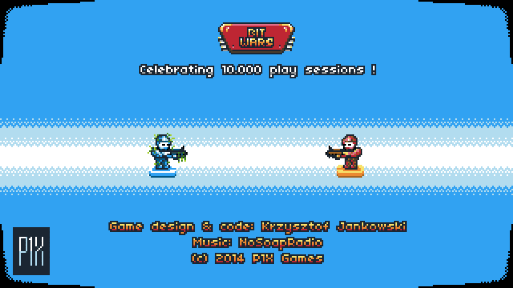

# BitWars — OUYA port

A native-feeling OUYA build of **BitWars**, the turn‑based strategy game
*"about moving the terrain"* made by **Krzysztof Jankowski (P1X)** in 2014.

BitWars was **literally built for the OUYA** — it already ships an OUYA button
map and an OUYA‑branded bitmap font — but it was **never released** on the
console. This port finally gets it running on real hardware.

> Original game & source: https://github.com/w84death/BitWars
> This repository is a fork; the port lives entirely under [`ouya/`](.).



---

## What this is

BitWars is an **HTML5 / ImpactJS** game (Canvas 2D, 320×180 internal
resolution, HTML5 Audio). The OUYA's stock Android 4.1 WebView is the old
WebKit one and has **no W3C Gamepad API**, so the game — which is controlled
entirely with a gamepad — cannot work in it.

The fix is to ship the game inside a **Crosswalk** (embedded Chromium) runtime
instead of the system WebView. Crosswalk provides the Gamepad API, a modern
Canvas 2D implementation and working HTML5 Audio, all on Android 4.1.

The result is a **single, self‑contained APK** (the Chromium runtime is bundled
— no second "runtime" app to install) that drops straight into the OUYA
*"PLAY"* games menu.

| | |
|---|---|
| Engine | ImpactJS (HTML5 Canvas 2D) |
| Runtime | Crosswalk `23.53.589.4` (Chromium 53), embedded mode |
| ABI | `armeabi-v7a` (OUYA = NVIDIA Tegra 3) |
| Min / target SDK | 16 (Android 4.1) / 21 |
| APK size | ~39 MB (single file, runtime included) |
| Controller | Works via Crosswalk's Gamepad API |
| Audio | Works (HTML5 Audio — the game never used WebAudio) |

---

## Controls

The game's original OUYA mapping is used as‑is (see
`ouya/app/src/main/assets/www/lib/game/main.js`):

| OUYA control | Action |
|---|---|
| D‑pad | Move the cursor / terrain |
| **O** (FACE_1) | Next turn |
| **A** (FACE_2) | Buy unit 3 |
| **U** (FACE_3) | Buy unit 1 |
| **Y** (FACE_4) | Buy unit 2 |
| Left shoulder (L1) | Action / confirm |
| Right shoulder (R1) | Extras |
| Left analog stick | Also moves (±0.7 threshold) |

---

## Building

See **[docs/OUYA_PORT.md](docs/OUYA_PORT.md)** for the full technical write‑up.
Short version:

1. Drop the Crosswalk runtime AAR into `ouya/app/libs/`
   (`xwalk_core_library-23.53.589.4.aar` — committed here; provenance documented
   in the port doc).
2. From `ouya/`:
   ```sh
   # JDK 11, Android SDK with build-tools + platform 30
   export JAVA_HOME=/path/to/jdk-11
   ./gradlew assembleDebug
   ```
3. Install on the console:
   ```sh
   adb connect <ouya-ip>:5555
   adb install -r app/build/outputs/apk/debug/app-debug.apk
   ```

The debug APK is signed with the Android debug key and installs/sideloads fine.

---

## Credits

- **BitWars** — game design & code by **Krzysztof Jankowski / P1X**
  (https://p1x.in), music by *NoSoapRadio*. Original license:
  *"do what you want and don't bother me."*
- **OUYA port** — Crosswalk wrapper, build system and documentation.
- **Crosswalk Project** — Intel's embeddable Chromium runtime that makes
  HTML5 games possible on Android 4.1.

Long live the micro‑console.
